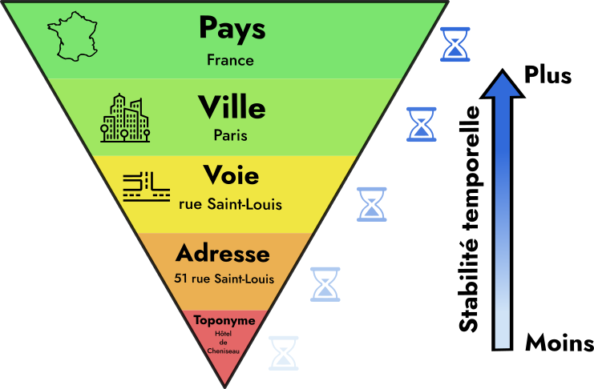

# 🙤 **PARTIE 3** 🙧
# Géocodage et cartographie des photographies d'[Eugène Atget](https://fr.wikipedia.org/wiki/Eug%C3%A8ne_Atget)

🙑 **Rappel**. Dans la [partie 2](https://github.com/HueyNemud/tnah-2026-partie2), nous avons extrait à l'aide de Mistral les entités géographiques contenues dans le titre et les thèmes Rameau des photographies.
Chaque graphe de photographie individuel est désormais accompagné d'un fichier JSON contenant informations géographiques structurées en **cinq niveaux de granularités spatiale croissante**. Par exemple :

```json
{
    "toponyme": "Bibliothèque de l'Arsenal",
    "adresse": "5 rue de Sully",
    "voie": "rue de Sully",
    "ville": "Paris",
    "pays": "France"
}
```

## ⚠️ Prérequis

- Avoir **terminé la partie 2**.
- Le dossier `photographies_avec_themes/` doit exister dans le répertoire de la partie 2 et **doit contenir les fichiers `<ark>.ttl` et `<ark>.json`** de chaque photographie assignée à votre équipe.

<hr/>

## 🙤 Objectifs

Cette troisième partie se décompose en deux étapes :

1. **Géocoder** les informations géographiques extraites avec Mistral, c'est à dire assigner des **coordonnées géographiques** pour ces informations.

2. Créer une interface Web simple pour cartographier les photographies d'Atget.

Légende des pictogrammes utilisés :

| Picto. | Légende                                   |
| ------ | ----------------------------------------- |
| 🎬      | Action à réaliser : à vous de jouer !     |
| 💡      | Suggestion d'action complémentaire        |
| ⚠️      | Avertissement                             |
| ℹ️      | Information supplémentaire ou astuce      |
| 📚      | Ressources : documentation, article, etc. |

<hr/>

## 🙤 Chapitre 1 : Géocodage des information géographiques extraites avec Mistral

### Préparation

> 🎬 Copiez le dossier `photographies_avec_themes/` de la partie 2 vers le répertoire courant. Vérifiez que chaque fichier `.ttl` des graphes des photographies est associé à un fichier `.json` contenant les informations géographiques extraites de la photo correspondante.

### Stratégie générale de géocodage

Désigner des entités géographiques (=un lieu) peut être fait de deux manières.
On parle de **référence directe** quand on donne la position précise avec des coordonnées géographiques, et de **référence indirecte** quand on utilise un nom ou une étiquette (une adresse, un nom de lieu, etc.) pour désigner ce lieu.

Le **géocodage** est le **processus automatisé** qui transforme une référence indirecte en une référence directe.
Pour simplifier, on peut considérer un géocodeur comme un moteur de recherche qui renvoie les coordonnées géographiques d'un lieu dont on fournit le nom.

Il existe de nombreux outils de géocodage, propriétaires (ex. celui de Google Maps), ou *open source* (ex. celui du Géoportail de l'IGN).
Nous allons utiliser ici le géocodeur *open source* d'*Open Street Map (OSM)* nommé [**Nominatim**](https://nominatim.openstreetmap.org/ui/search.html).

Ce géocodeur exploite donc les données de OSM, qui sont contemporaines. Comme les photos datent du début XX<sup>e</sup> siècle, adresses et lieux peuvent avoir changé ou avoir disparu.
L'anachronisme du géocodeur provoquera donc inévitablement des échecs.

ℹ️ En situation réelle, une phase de validation manuelle serait donc obligatoire.

Heureusement, tous les niveaux de granularité spatiale n'évoluent pas au même rythme.
Les toponymes (noms de cabarets, etc.) sont les références spatiales les plus précises mais les moins pérennes.
Les adresses sont un peu plus stables, les rues encore davantage, etc.
La hiérarchie spatiale est également une hiérarchie de stabilité temporelle :


Nous pouvons tirer profit de cette stabilité croissante pour créer un algorithme de géocodage incrémental simple testant essayant dans l'ordre les géocodage suivants et s'arrêtant à la première réussite :

| Étape | Niveau | Éléments inclus | Exemple |
| :--- | :--- | :--- | :--- |
| **1** | toponyme | toponyme, adresse, ville, pays | "Bibliothèque de l'Arsenal, 5 rue de Sully, Paris, France" |
| **2** | adresse | adresse, ville, pays | "5 rue de Sully, Paris, France" |
| **3** | voie | voie, ville, pays | "Rue de Sully, Paris, France" |
| **4** | ville | ville, pays | "Paris, France" |
| **5** | pays | pays | "France" |

En cas de réussite, les coordonnées obtenues peuvent être sauvegardées comme localisation de la photographie.

### Boucle principale de géocodage

⚠️ Tout le code est à réaliser dans le fichier de script `geocoding.py`

Commençons par mettre en place la structure générale du traitement.
> 🎬 Ouvrez le fichier `geocoding.py` pour compléter **uniquement** la fonction principale `main()` pour implémenter le pseudo-code suivant. Aidez-vous des fonctions déjà implémentées.
>
> ```raw
> Pour chaque fichier JSON dans le dossier `photographies_avec_themes/`:
>   Afficher "📁 Processing: {json_file.name}"
>   Pour chaque niveau hiérarchique dans l'ordre "toponyme", "adresse", "voie", "ville", "pays"
>      Crée la requête de géocodage adéquate avec `build_geocoding_query(data: dict, level: str)`
>      Si la requête n'est pas une chaîne vide:
>         Exécute le géocodage de la requête avec `geocode(query: str)` et
>         stocke le résultat dans une variable `location`
>         Si `location` n'est pas None:
>             Afficher "[{level}] ✅ : {location}"
>             Passer au fichier suivant (ℹ️  utiliser le mot clé Python `break`)
>         Sinon:
>             Afficher "[{level}] ❌"
> ```
>
> 🎬 Exécutez le script depuis le terminal
>
> ```bash
> uv run geocoding.py
> ```

Le terminal doit afficher :

```raw
📁 Processing: cb40276760h.json
[toponyme] 🔍 Query : ...
📍 Geocoding : ...
[toponyme] ❌
[adresse] 🔍 Query : ...
📍 Geocoding : ...
[adresse] ❌
[voie] 🔍 Query : ...
📍 Geocoding : ...
[voie] ❌
[ville] 🔍 Query : ...
📍 Geocoding : ...
[ville] ❌
[pays] 🔍 Query : ...
📍 Geocoding : ...
[pays] ❌
```

### Construction des requêtes hiérarchiques

La fonction `build_geocoding_query(data: dict, level: str) -> str` est chargée de construire la requête de géocodage pour un niveau hierarchique donné en paramètre à partir des indices géographiques lus dans le fichier json.

Voici un code partiel de cette fonction :

```python
def build_geocoding_query(data: dict, level: str) -> str:
    """Construit une requête de géocodage en fonction du niveau de précision demandé."""
    values = {
        "pays": data.get("pays") or "France",
        "ville": data.get("ville") or "Paris",
    }

    if level not in values:
        return ""

    if level == "pays":
        query = [values["pays"]]
    elif level == "ville":
        query = [values["ville"], values["pays"]]
    else:
        return ""

    # On filtre les éléments vides et on joint avec des virgules
    query = ", ".join(part for part in query if part)

    print(f"[{level}] 🔍 Query : {query}")
    return query
```

> 🎬 Remplacez le contenu de la fonction `build_geocoding_query(...)` dans le fichier `geocoding.py` par ce code partiel.
>
> 🎬 Complétez la fonction `build_geocoding_query(...)` pour gérer les niveaux manquants :  "voie", "adresse" et "toponyme". Appuyez-vous sur le tableau plus haut.
>
> 🎬 Exécutez le script `geocoding.py`.

Le terminal doit afficher un résultat similaire à :

```raw
Processing : cb40276760h.json
[toponyme] 🔍 Query : Chapelle Lavalière, Paris, France
📍 Geocoding : Chapelle Lavalière, Paris, France
[toponyme] ❌
[adresse] 🔍 Query : 284 rue Saint-Jacques, rue Saint-Jacques, Paris, France
📍 Geocoding : 284 rue Saint-Jacques, rue Saint-Jacques, Paris, France
[adresse] ❌
[voie] 🔍 Query : rue Saint-Jacques, Paris, France
📍 Geocoding : rue Saint-Jacques, Paris, France
[voie] ❌
[ville] 🔍 Query : Paris, France
📍 Geocoding : Paris, France
[ville] ❌
[pays] 🔍 Query : France
📍 Geocoding : France
[pays] ❌
```

### Mise en place du géocodeur Nominatim

Pour requêter l'API du géocodeur d'OpenStreetMap, nous allons utiliser la bibliothèque [`GeoPy`](https://geopy.readthedocs.io/en/stable/) qui offre un accès unifié à plusieurs dizaines de géocodeurs accessibles en ligne.

> 🎬 Installer GéoPy avec uv depuis le terminal :
>
> ```bash
> uv add geopy
> ```

Nous aurons besoin d'importer les éléments suivants de la bibliothèque geopy :

```python
# Classe encapsulant l'accès au géocodeur Nominatim d'OpenStreetMap
from geopy.geocoders import Nominatim
# Le résultat d'un géocodage est un objet de type Location
from geopy.location import Location
# Un rate limiter permet de limiter le nombre de requêtes envoyées par secondes
# En effet, Nominatim **bannit** les usagers qui "spamment" le géocodeur
from geopy.extra.rate_limiter import RateLimiter
```

> 🎬 Ajoutez ces trois imports en entête du fichier `geocoding.py`.

Appeler le constructeur de la classe `Nominatim()` instancie une représentation du géocodeur Nominatim.

Ce constructeur prend le paramètre obligatoire `user_agent=...` qui est une chaîne de caractère qui vous identifie auprès de l'API.

> 🎬 Dans `geocoding.py`:
>
>- cherchez en début de fichier la ligne `geocoder=...` et remplacez les `...` par la création d'une instance de Nominatim
>- le  `user_agent`  doit être "tnah-équipe-X" où X est le numéro de votre équipe.

On peut ensuite ajouter un *rate limiter* sur ce géocodeur de la manière suivante :

```python
# Garantit que les requêtes envoyées seront séparées d'au moins 1 seconde
RateLimiter(geocoder.geocode, min_delay_seconds=1)
```

> 🎬 Completez la ligne `limited_geocoder=...` pour créer un `RateLimiter`  espaçant les requêtes d'une seconde au minimum.

Pour géocoder une requête et récupérer un résultat de type `Location`, il suffit d'appeler :

```python
limited_geocoder(query)
```

> 🎬 Modifiez le corps de la fonction `geocode(query: str)` pour qu'elle :
>
> 1. Géocode la requête donnée en paramètre avec `limited_geocoder`
> 2. Stocke le résultat dans une variable nommée `location`
> 3. Retourne `location`, qui peut être un objet `Location`, ou `None` si l'opération a échoué.

Le géocodage est maintenant **opérationnel** et requête les serveurs de Nominatim !

⚠️ **Attention** À partir de maintenant **LIMITEZ** le nombre de fichiers JSONs traités à 5 pour éviter d'être **bloqué.e.s par Nominatim** durant le développement.

> 🎬 Exécutez le script `geocoding.py`.

Le terminal doit afficher un résultat similaire à :

```raw
📁 Processing: cb40276835k.json
[toponyme] 🔍 Query : Cabaret du Père Lunette, Paris, France
[toponyme] ❌
[adresse] 🔍 Query : rue des Anglais, Paris, France
[adresse] ✅ : Rue des Anglais, Quartier de la Sorbonne, Paris 5e Arrondissement, Paris, Île-de-France, France métropolitaine, 75005, France
```

### Export du géocodage

Nous allons stocker le résultat du géocodage de chaque photographie dans un fichier compagnon du fichier `.ttl`.

Il existe plusieurs formats standards pour stocker une information géographique.
Le plus utilisé pour le Web est GeoJSON, qui est un schéma JSON spécialisé que savent lire tous les SIG et outils de cartographie Web.

Une bibliothèque Python permet de manipuler ce format : `geojson`.

> 🎬 Installer `geojson` avec uv depuis le terminal :
>
> ```bash
> uv add geojson
> ```
>
> 🎬 Importez `geojson` en entête de `geocoding.py`.

Le format GeoJSON stocke l'information géographique dans un objet JSON nommé `Feature`.
- Une `Feature` représente une entité géographique. Elle est composée de deux éléments : 
  - `geometry` : la forme et la position de l'entité sur Terre, représentées par un point, une polyligne ou un polygone avec des coordonnées géographiques
  - `properties` : le dictionnaire des données attributaires de l'entité.

Voici un exemple de fichier GeoJSON contenant les résultat d'un géocodage :

```json
{
  "type": "Feature",
  "geometry": {
    "type": "Point",
    "coordinates": [
      2.354697,
      48.855509
    ]
  },
  "properties": {
    "extraction": {
      "édifice": "Église Saint-Gervais-Saint-Protais",
      "ville": "Paris",
      "pays": "France"
    },
    "query": "Église Saint-Gervais-Saint-Protais, Paris, France",
    "level": "toponyme",
    "location": {...}
}
```

On a stocké dans cette `Feature` les attributs suivants :

- `"extraction"` : données d'entrées, les indices géographiques extraits par Mistral ;
- `"query"` : la requête de géocodage effectuée ;
- `"level"` : le niveau de la requête effectuée
- `"level"` : l'objet `Location` renvoyé par Nominatim

Voici quatre blocs de codes qui, placés au bon endroit dans le script, permettent de construire un objet `Feature` pour chaque résultat de géocodage puis de le stocker dans un fichier JSON avec l'extension `.geojson`.

> 🎬 Placez ces blocs de code à l'endroit approprié dans le fichier `geocoding.py` puis exécutez le script. Les fichiers `.geojson` doivent apparaître dans le dossier `photographies_avec_themes`.

**Bloc 1: Fonction de création d'une `Feature`**

```python
def create_geojson_feature(location: Location, properties: dict) -> geojson.Feature:
    point = geojson.Point((location.longitude, location.latitude))
    feature = geojson.Feature(geometry=point, properties=properties)
    return feature
```

**Bloc 2: Sauvegarde d'une `Feature` dans un fichier GeoJSON**

```python
def save_geocoding(feature: geojson.Feature, input_json_file: Path) -> None:
    output_file = input_json_file.with_suffix(".geojson")
    with open(output_file, "w") as file:
        geojson.dump(feature, file, indent=2, ensure_ascii=False)
    print(f"📁 Saved: {output_file}")
```

**Bloc 3: Construction d'un dictionnaire des propriétés d'une `Feature`**

```python
properties = {
    "extraction": data,
    "query": geocoding_query,
    "level": level,
    "response": location.raw,
    "photo_id": json_file.stem,
}
```

**Bloc 4: Création et sauvegarde d'un objet `Feature`**

```python
feature = create_geojson_feature(location, properties)
save_geocoding(feature, json_file)
```

On peut visualiser un fichier GeoJSON très simplement sur [https://geojson.io/](https://geojson.io/).

> 🎬 Ouvrez l'un des fichiers `.geojson` générés et copiez son contenu sur [https://geojson.io/](https://geojson.io/). Vérifiez qu'un point s'affice sur la carte et que les attributs de la Feature son corrects.

### Traitement complet

Nous allons ajouter une sortie de debug en rassemblant toutes Features créées en une FeatureCollection exportée dans un fichier GeoJSON dédié.

> 🎬 Avant le début de la boucle de traitement principal : créez une liste vide `features = []`
>
> 🎬 Dans la boucle de traitement principal : ajoutez chaque Feature crée à cette liste : `features.append(feature)`
>
> 🎬 Après la boucle de traitement principal : ajoutez l'export de la FeatureCollection complete :
>
>```python
> debug_geojson_file = Path("debug_geocoding_results.geojson")
> feature_collection = geojson.FeatureCollection(features)
> with open(debug_geojson_file, "w") as file:
>     geojson.dump(feature_collection, file, indent=2, ensure_ascii=False)
> print(f"📁 Saved on disk: {debug_geojson_file}")
>```
>
> 💡**Dernier ajustement**
> Le prompt utilisé dans la partie 2 ne contraignait pas entièrement le schéma JSON des informations extraites, laissant Mistral créer de nouvelles clés lorsque les métadonnées ne correspondaient pas à l'exemple simple donnée.
> Typiquement, le modèle peut avoir créé des clés `"établissement"`, `"édifice"`, etc.
> Pour ne pas perdre cette information, nous pouvons traiter ces champs supplémentaires comme s'ils étaient du niveau "toponyme".
>
>
> Pour cela, il faut modifier dans la fonction `build_geocoding_query()` et remplacer...
>
> ```python
> "toponyme": data.get("toponyme") or ""
>
>```
>
> ...par...
>
> ```python
> "toponyme": data.get("toponyme")
> or data.get("édifice")
> or data.get("place")
> or data.get("établissement")
> or ""
> ```
>
>🎬 **Enfin, retirer la limite de traitement et exécutez le script complet**.
> Vérifiez que le fichier `debug_geocoding_results.geojson` est créé et copiez son contenu sur [https://geojson.io/](https://geojson.io/) pour visualiser les localisation des photos géolocalisées.

<hr/>

### 🏁 Fin du chapitre 1

Chaque photo géocodée possède est désormais associé à une entité géographique d'OpenStreetMap, stockée en GeoJSON dans un fichier dédié.

Il est temps de passer au **chapitre ultime** pour enfin cartographier le corpus des photos !
