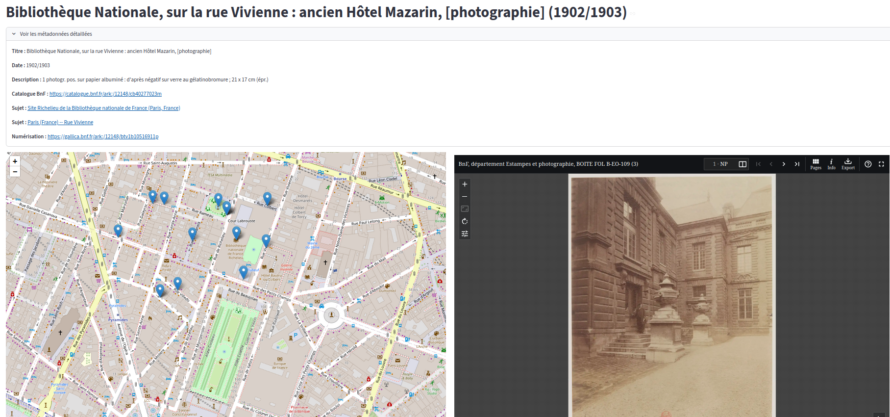
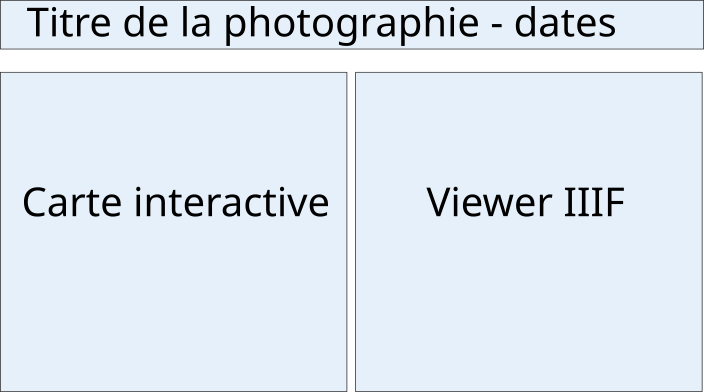

# 🙤 **PARTIE 3** 🙧
# Géocodage et cartographie des photographies d'[Eugène Atget](https://fr.wikipedia.org/wiki/Eug%C3%A8ne_Atget)

🙑 **Rappel**. Le dossier `photographies_avec_themes/` contient maintenant, pour chaque photographie recensée : 

- un fichier Turtle (.ttl) contenant le graphe de métadonnées décrivant cette photographie ;
- un fichier JSON (.json) contenant les indices géographiques extraits des métadonnées à l'aide de Mistral;
- un fichier GeoJSON (.geojson) contenant une *Feature* géographique résultant du géocodage des indices géographiques par le géocodeur d'OpenStreetMap, Nominatim.

## ⚠️ Prérequis

- Avoir **terminé le chapitre 1**.
- Le dossier `photographies_avec_themes/` doit exister dans le répertoire de la partie 2 et **doit contenir les fichiers `<ark>.ttl`, `<ark>.json` et `<ark>.geojson`** de chaque photographie assignée à votre équipe.

<hr/>

## 🙤 Objectifs

La troisième partie se décompose en deux étapes :

1. **Géocoder** les informations géographiques extraites avec Mistral, c'est à dire assigner des **coordonnées géographiques** pour ces informations.

2. Créer une interface Web simple pour cartographier les photographies d'Atget.

Légende des pictogrammes utilisés :

| Picto. | Légende                                   |
| ------ | ----------------------------------------- |
| 🎬      | Action à réaliser : à vous de jouer !     |
| 💡      | Suggestion d'action complémentaire        |
| ⚠️      | Avertissement                             |
| ℹ️      | Information supplémentaire ou astuce      |
| 📚      | Ressources : documentation, article, etc. |

<hr/>

## 🙤 Chapitre 2 : Une interface  interactive d'exploration cartographique avec Streamlit.

### Motivation

[Streamlit](https://streamlit.io/) est une bibliothèque Python open source qui destinée à transformer des scripts de données en applications web interactives sans nécessiter de connaissances en développement web, uniquement en Python.

L'outil gère automatiquement la communication entre le serveur et le navigateur et permet d'éviter d'avoir à manipuler du langage Web (html, css, javascript, ...).

Streamlit est volontairement conçu pour être le plus simple possible à utiliser. L'objectif est de convertir un fichier Python linéaire en une application dynamique sans jamais sortir du mode "script". Chaque interaction de l'utilisateur déclenche une réexécution du code de haut en bas, mettant instantanément à jour l'affichage pour refléter l'état actuel des variables. 

C'est donc un outil idéal pour des *dashboards* expérimentaux, des visualisations de données interactives simples ou des preuves de concepts rapidement développées.

Nous allons utiliser Streamlit pour créer une **application interactive d'exploration du corpus de photrographies**, qui couple une **vue cartographique** des photos géocodées avec un **lecteur IIIF** qui charge les images des photos avec l'API IIIF de la BnF.

Voici un aperçu du résultat visé :



### Premiers pas

La première étape consiste à initialiser le projet et installer les bibliothèques utiles.
Nous allons avoir besoin de :

- `streamlit`  : le coeur de la bibliothèque Streamlit
- `folium` : une bibtliothèque Python pour créer des cartes interactives avec Leaflet
- `streamlit-folium` : plugin Streamlit pour intégrer Folium dans une application Streamlit
- `streamlit-iiif-viewer` : plugin Streamlit pour intégrer un *viewer* IIIF dans une application Streamlit. [Développé par Lucas Terriel à l'ENC](https://github.com/Lucaterre/streamlit-iiif-viewer) !
- `rdflib` : pour manipuler les graphes RDF de métadonnées de photos stockés dans les fichiers Turtle

> 🎬 Installez le nécessaire :
>
> ```bash
> uv add streamlit streamlit-folium folium rdflib
> ```

Le script `app.py` contiendra le code de notre application. Le fichier contient déjà le code Python nécessaire pour charger les métadonnées et localisations géographiques à partir des fichiers `.ttl` et `.geojson`.

> 🎬 Exécutez une première fois le script, il doit afficher un très grand dictionnaire de données. Comprenez-vous ce qu'il contient ?
>
> ```bash
> uv run app.py
> ```
>
> 🎬 Ouvrez le fichier `app.py` et essayez de comprendre ce que fait la fonction `load_all_photos()`, en lisant le code et en vous aidant de la sortie affichée sur le terminal à l'exécution.
> Complétez la docstring de la fonction, qui explique ce qu'elle fait et notamment **ce qu'elle renvoit**.

### Bases de l'application Streamlit

D'ordinaire, un script Python est linéaire : il lit des données, fait un calcul, produit un résultat et s'arrête.
Streamlit transforme ce script en une boucle infinie. L'application "écoute" l'utilisateur et, à chaque interaction, relance le script pour mettre à jour l'affichage.

Une application Streamlit se déclare composant par composant au fil d'un script Python et sera construire dans l'ordre linéaire d'exécution du script.

Remarquez dans `app.py` l'import initial `import streamlit` : c'est directement la bibliothèque qui va nous fournir tous les composants utiles, comme des briques Lego.

Il n'est pas nécessaire d'initialiser l'application, on peut directement déclarer des composants dans le code, et ils seront ajoutés à l'application dans l'ordre de leur déclaration !

Commençons par créer un titre de page, affichant le titre d'une première photographie chargée par défaut au démarrage de l'application.

> 🎬 Après  `BASES DE L'INTERFACE`, déclarer l'URI de la photo par défaut - piochez dans votre dossier `photographies_avec_themes/` !
>
> ```python
> default_uri = # ⚠️ URI de la MANIFESTATION : forme : "http://data.bnf.fr/ark:/12148/...#about"
> default_photo = photos_metadata.get(default_uri)
> ```

Une fois cette photo déclarée, on peut créer le composant *titre*. Pour afficher en haut de la page "<Titre de la photo> - <année(s)>"
> 🎬 Ajoutez à la suite
>
> ```python
> st.title(f"{default_photo['titre']} – {default_photo['date']}")
> ```
>
> 🎬 Lancez ensuite l'application (avec uv & streamlit), rendez-vous à l'URL donnée sur votre navigateur et vérifier que le titre s'affiche bien.
>
> ```bash
> uv run streamlit run app.py
> ```
>
> ℹ️ `streamlit run` crée un processus qui maintient l'application en ligne tant qu'il est lancé, et qui rééxécute automatiquement le script s'il change.

### Ajout de la carte

L'étape suivante consiste à ajouter une carte interactive Folium affichant toutes les localisations des photographies.

Sous le titre principal, nous allons créer deux zones cote à cote. La zone de gauche contiendra la carte, celle de droite la vue IIIF de la photographie sélectionnée:



On peut diviser la page en deux composants "colonnes" en appellant la fonction `st.columns().
Elle prend en paramètre une liste contenant les tailles des colonnes que l'on veut créer, et renvoie un **conteneur** par colonne.

> 🎬 Après le titre, divisez la page verticalement en deux conteneurs de taille égales.
>
> ```python
> map_container, iiif_container = st.columns([1, 1])
> ```

On pourra placer la carte et le visualisateur IIIF à l'intérieur du conteneur correspondant.
On va ensuite créer une carte Folium à l'intérieur de `map_container`.
Pour modifier le contenu d'un conteneur, Streamlit utilise le mécanisme Python de **[gestionnaire de contexte](https://www.pythoniste.fr/python/les-gestionnaires-de-contexte-et-linstruction-with-en-python/)**.

On déclare un contexte avec l'instruction `with`.

> 🎬 Créez un gestionnaire de contexte pour `map_container`:
>
> ```python
> with map_container:
>    # Toutes les instructions Streamlit st.... déclarées à l'intérieur de ce contexte 
>    # concerneront `map_container`, sans avoir besoin de le préciser à chaque appel !  
> ```

À l'intérieur de ce contexte, on peut alors créer une carte Folium, puis l'ajouter comme composant Streamlit à l'intérieur de `map_container`.

> 🎬 Déclarez dans le conteneur :
>
> ```python
> # ... une carte Folium centrée sur Paris
> interactive_map = folium.Map(location=[48.8566, 2.3522], zoom_start=13)
> # ... et on la transforme en composant Streamlit avec le plugin `st folium`. 
> map_data = st_folium(interactive_map, use_container_width=True, height=800)
>```

ℹ️  l'objet `map_data` retourné par `st_folium` stocke les données d'interaction de l'utilisateur avec la carte.
Cette variable sera cruciale plus tard pour gérer l'interaction entre la carte et le viewer IIIF !

> 🎬 Vérifiez que la carte (vide de points) apparaît sur l'application !

💡La vue est tassée au milieu de la page ?
On peut changer la mise en page de l'application pour qu'elle prenne toute la largeur.
Il suffit de déclarer le *layout* adapté au début de la création des composants Streamlit, juste après `# BASES DE L'INTERFACE` :

```python
st.set_page_config(layout="wide")
```

Reste à ajouter les positions des photos à la carte, comme des points cliquables.
Pour cela, on doit transformer chaque *Feature* chargée depuis les fichiers `geojson` en objet Folium ponctuel.

On aimerait aussi que cet objet affiche le **titre** de la photo quand on passe le curseur dessus, et contienne **l'uri** de la photo comme identifiant.

Voici une fonction qui réalise cette transformation.

```python
def build_folium_feature(location: dict, photo_title: str, photo_uri: str):
    """Crée une feature Folium à partir du geojson de localisation d'une photo."""
    folium_feature = folium.GeoJson(location, tooltip=photo_title)
    folium_feature["properties"]["uri"] = photo_uri
    return folium_feature
```

> 🎬 Ajoutez cette fonction dans la section `# FONCTIONS DE TRANSFORMATION DE DONNÉES`.

On peut ensuite déclarer une nouvelle fonction qui se charge de créer une *Feature* Folium pour chaque localisation de photographie :

```python
def add_locations_to_map(m: folium.Map, photos_metadata: dict[str, dict]):
    """Ajoute les localisations de toutes les photos sur la carte."""
    for photo in photos_metadata.values():
        feature = build_folium_feature(photo["location"], photo["titre"], photo["uri"])
        feature.add_to(m)
```

> 🎬 Ajoutez cette fonction dans la section `# FONCTIONS DE TRANSFORMATION DE DONNÉES`.
> Puis appelez là juste avant de transformer la carte en composant folium.
>
>```python
>#m = folium.Map(...
>add_locations_to_map(m, photos_metadata)
>#map_data = st_folium(...
>```

Vous devriez maintenant voir apparaître les points sur la carte, avec le titre de la photo au survol !

### Ajout de la vue IIIF

Passons maintenant au conteneur `iiif_container`.

Comme pour la carte, on va déclarer son contenu à l'intérieur d'un gestionnaire de contexte.
> 🎬 À la suite **et à l'extérieur** du conteneur `map_container`, déclarez un contexte pour `iiif_container`
>
> ```python
> with iiif_container:
>    # Toutes les instructions Streamlit st.... déclarées à l'intérieur de ce contexte 
>    # concerneront `iiif_container`, sans avoir besoin de le préciser à chaque appel !  
> ```

À l'intérieur de ce conteneur, on peut créer un composant IIIF pour Streamlit avec `streamlit_iiif_viewer`.

> 🎬 Dans le conteneur, ajoutez un composant Streamlit IIIF qui encapsule le visualiseur IIIF [Tify](https://tify.rocks/?tify=%7B%22pages%22%3A%5B2%2C3%5D%7D)
> ```python
>iiif_viewer(
>    viewer="tify",
>    manifest=url_iiif,
>    height=800,
>)
> ```

⚠️ Remarquons que `iiif_viewer()` prend en paramètre l'URL du **manifest IIIF** de l'image à afficher.
Dans le code ci-dessu, l'URL du manifest est attendu dans une variable `url_iiif` qui n'existe pas encore.
Nous devons la créer, mais elle n'existe pas telle quelle dans les médatonnées.

Pas de panique, on peut la construire grace à l'URL d'une des numérisations Gallica qui fournit l'ARK de l'image, en s'aidant de la **[documentation de l'API IIIF de la BnF](https://api.bnf.fr/fr/api-iiif-de-recuperation-des-images-de-gallica)**.

💡 Voyons ensemble comment cette API fonctionne !

> 🎬 Dans la section `# FONCTIONS DE TRANSFORMATION DE DONNÉES`, ajoutez la fonction suivante qui construire l'URL du manifeste IIIF correspondant à un lien Gallica :
>
> ```python
>def build_iiif_url(gallica_link):
>    """Transforme un lien Gallica en manifeste IIIF."""
>    parts = gallica_link.split("ark:/12148/")
>    ark_id = parts[1]
>    return (
>        f"https://openapi.bnf.fr/iiif/presentation/v3/ark:/12148/{ark_id}/manifest.json"
>    )
>```
>
> 🎬 Appelez ensuite cette fonction dans le container pour assignez à `uri_iiif` le manifest de la **première numérisation** de la photo par défaut `default_photo` :
>
>```python
># with iiif_container:
>       url_iiif = build_iiif_url(default_photo["gallica_urls"][0])
>#     iiif_viewer(...
>```

Vous devriez maintenant voir apparaître les points sur la carte, avec le titre de la photo au survol !

### Et maintenant, un peu d'interactivité

Nous avons maintenant une carte contenant les points des photos, et un visualiseur IIIF fonctionnel, mais qui affiche toujours la même photographie.

Pour finir, ajoutons un mécanisme d'interaction pour **modifier le titre et l'image affichée quand on clique sur un point de la carte !**.

La première étape consiste à récupérer l'URI de la photographie associée au point sélectionné sur la carte.

C'est là qu'intervient la variable `map_data` renvoyée par l'appel à `st_folium()` : c'est un dictionnaire qui contient l'état de la carte courante, avec notamment la propriété `"last_active_drawing"` qui donne la *Feature* Folium sélectionnée par l'utilisateur.

Puisque la fonction `build_folium_feature()` crée des *Features* ponctuelles Folium stockant dans leurs propriétés l'URI de la photo.

Pour cela, nous allons utiliser l'objet Streamlit `st.session_state`.
Il s'agit d'un espace de l'espace de stockage temporaire de l'application, dans lequel on peut lire et écrire des informations.

En l'occurence, nous allons nous en servir pour stocker l'URI de la photo cliquée.

> 🎬 Ajoutez dans le conteneur `map_container` la capture de la *Feature* cliquée et le stockage de son URI dans `st.session_state` :
>
>```python
>selected_feature = map_data["last_active_drawing"]
>   if selected_feature:
>       selected_uri = selected_feature["properties"]["uri"]
>       print(f"Photo sélectionnée : {selected_uri}")
>       st.session_state.selected_uri = selected_uri

Pour mettre à jour le visualiseur IIIF, il faut tout de même forcer Streamlit à rafraîchir entièrement l'application.

> 🎬 Pour forcer le rafraîchissement des composants de l'application, appelez `st.rerun()` après `st.session_state.selected_uri = selected_uri`.
>```python
>       # st.session_state.selected_uri = selected_uri
>       st.rerun()  # Force Streamlit à réexécuter le script
>```

Vous devriez constater que l'UI se bloque et que le terminal affiche en boucle :

```bash
Photo sélectionnée : http://data.bnf.fr/ark:/12148/...
```

En effet, il nous manque un test : on veut appeler `st.rerun()` **uniquement** si l'URI actuellement sélectionnée est différente de celle déjà stockée dans la mémoire de l'application !

> 🎬 Modifiez le code en conséquence :
>
>```python
>        if selected_uri != st.session_state.selected_uri:
>            print(f"Photo sélectionnée : {selected_uri}")
>            st.session_state.selected_uri = selected_uri
>            st.rerun()
>```

La boucle infinie ne devrait plus se produite - mais la mise à jour de la vue ne fonctionne toujours pas.
C'est bien normal : dans le conteneur `iiif_container`, la variable `url_iiif` contient toujours la même URI.

Nous avons besoin d'un mécanisme pour récupérer **l'URI courante**, c'est à dire celle stockée en mémoire.

L'idée est de "l'attraper" quand Streamlit relit entièrement le code après l'appel à `st.rerun()`.

> 🎬 Remplacez la ligne `default_photo = photos_metadata.get(default_uri)` par le bloc suivant, puis remplacez toutes les utilisations de `default_photo` par `current_photo` :
>
>```python
>if "selected_uri" not in st.session_state:
>    st.session_state.selected_uri = default_uri
>current_photo = photos_metadata[st.session_state.selected_uri]
>```

La mise à jour dynamique devrait être fonctionnelle !

⚠️ L'application est lente ? Voyons ensemble comment l'accélérer avec `@st.cache_data`

### Bonus : ajout d'une boite de métadonnées


On peut ajouter une petite **infobox** pour afficher les principales métadonnées d'une photographie.

> 🎬 Voici une fonction dédiée. Ajoutez là au script puis appelez là pour placer l'infobox juste sous le titre de la photographie.
>
>```python
>def afficher_infobox(p):
>    """Affiche les métadonnées dans un menu déroulant."""
>    with st.expander("Voir les métadonnées détaillées"):
>        st.write(f"**Titre :** {p['titre']}")
>        st.write(f"**Date :** {p['date']}")
>        st.write(f"**Description :** {p['description']}")
>        if p["catalogue"]:
>            st.write(f"**Catalogue BnF :** [{p['catalogue']}]({p['catalogue']})")
>        for s in p["sujets"]:
>            st.write(f"**Sujet :** [{s['label']}]({s['uri']})")
>        for link in p["gallica_urls"]:
>            st.write(f"**Numérisation :** [{link}]({link})")

<hr/>

### 🏁 Fin du chapitre 1

Enfin terminé, le corpus Atget est maintenant cartographié  et explorable en ligne ! 🎉🎉

**Pour aller plus loin**, essayez de déployer votre application sur le Web gratuitement avec Streamlit Cloud : https://streamlit.io/cloud